# Recopilación Pasiva de Información utilizando Google Hacking y Shodan
## Google Hacking 

Organización elegida:
https://www.hackthissite.org/
"Hack This Site" es un entorno autorizado para realizar prácticas de hacking, por lo que puedes intentar técnicas avanzadas de seguridad sin preocuparte por posibles repercusiones legales.

### Buscar páginas que mencionen "pride" en el contenido del sitio
```
site:hackthissite.org intext:"pride"
```
- Este comando listará las páginas dentro del dominio `hackthissite.org` que mencionan específicamente "pride" en su contenido.
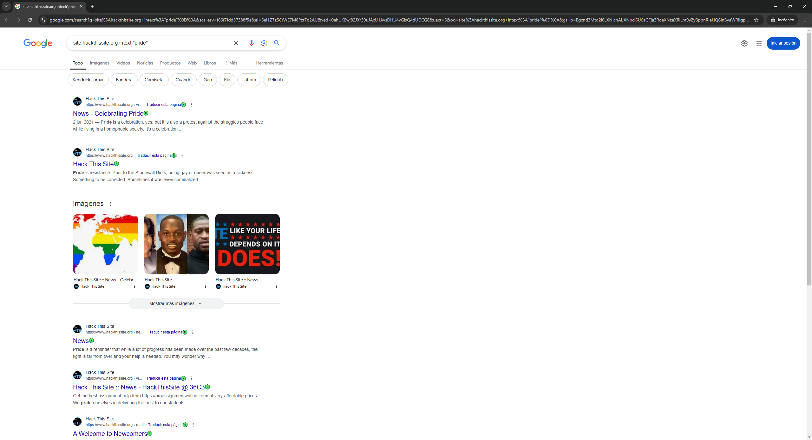
### Buscar archivos PDF
```
site:hackthissite.org filetype:pdf
```
- Esta búsqueda mostrará únicamente archivos en formato PDF alojados en el dominio, lo cual es útil para encontrar documentación descargable.


### Buscar términos relacionados con "security" o "vulnerability"
```
site:hackthissite.org "security" OR "vulnerability"
```
- Con esto obtendrás páginas donde se mencionan al menos uno de estos dos términos, ideal para encontrar secciones de educación en seguridad y vulnerabilidades.
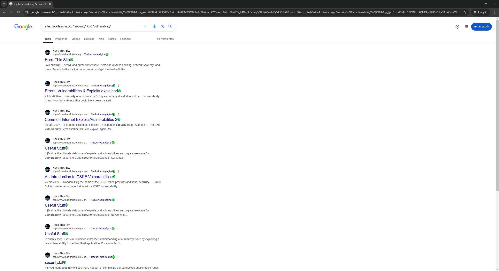
### Excluir resultados que contengan "foro" al buscar "tutorial"
```
site:hackthissite.org "tutorial" -inurl:"forum"
```
- Esta búsqueda te permite filtrar las páginas del foro y enfocarte en tutoriales que no estén dentro de esa sección específica.
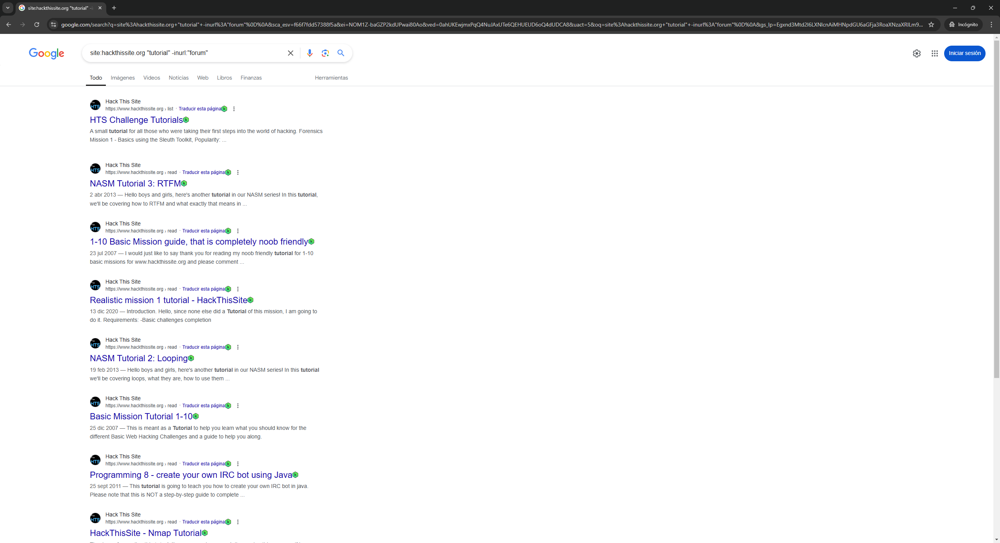
### Buscar páginas con "beginner" en el título y "challenge" en el contenido
```
site:hackthissite.org intitle:"beginner" intext:"challenge"
```

- Esto puede ayudarte a localizar retos de nivel principiante y encontrar información o guías en el contenido de esas páginas.

### Buscar páginas que mencionen "Bitcoin" en el contenido.
```
site:hackthissite.org intext:"criptografía"
```
- Esto es útil para localizar desafíos o artículos que aborden temas de bitcoin.
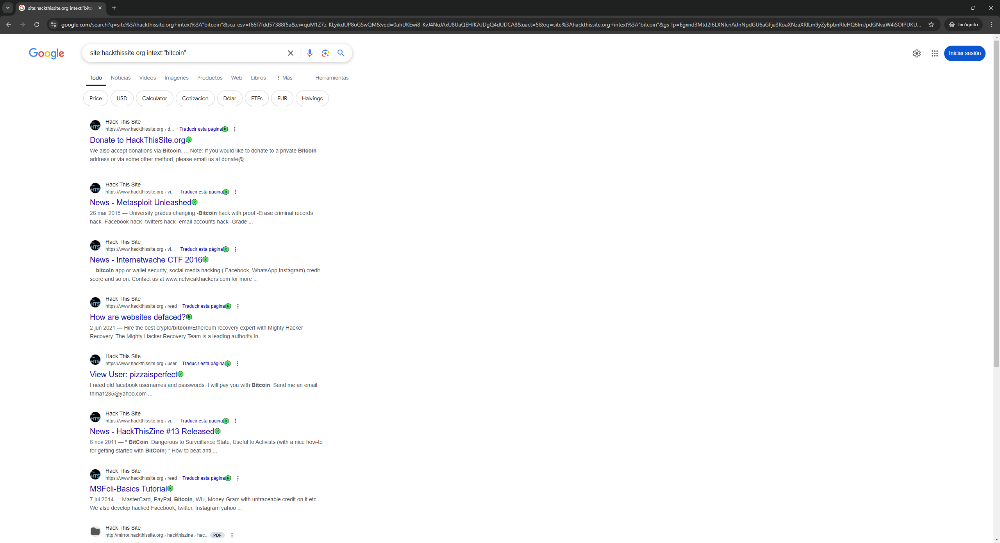
## Consulta con Google Dorks:
### Búsqueda de archivos que contienen credenciales de acceso de AWS
> https://www.exploit-db.com/ghdb/8446
```
intext:"aws_access_key_id" | intext:"aws_secret_access_key" filetype:json | filetype:yaml
```
- Este **Google Dork** es útil para **buscar archivos expuestos** que contienen **credenciales de AWS**, como el **`aws_access_key_id`** y **`aws_secret_access_key`**, en **archivos JSON** o **YAML**. Sin embargo, hay que ser consciente de las implicaciones éticas y legales de realizar búsquedas de este tipo, y usarlas siempre en un contexto controlado y legal.
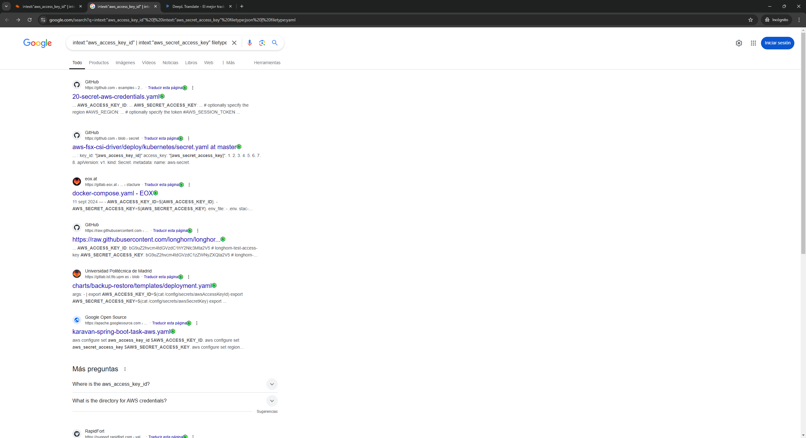

### Encontrar páginas web de la instalación de la versión 2 de PowerCMS, específicamente aquellas que tienen la página de instalación activa
> https://www.exploit-db.com/ghdb/8402
```
intitle:"Installation Wizard - PowerCMS v2"
```
- Este tipo de búsqueda puede ser útil para identificar configuraciones mal aseguradas o vulnerabilidades en sitios web, pero debe realizarse siempre con responsabilidad y dentro de un contexto ético y legal.

### Encontrar repositorios en GitHub que **contengan claves privadas de OpenSSH expuestas**.
> https://www.exploit-db.com/ghdb/8451
```
site:github.com "BEGIN OPENSSH PRIVATE KEY"
```
- Cualquier persona que tenga acceso a ellas puede usarlas para **acceder a sistemas y servidores** de manera no autorizada.
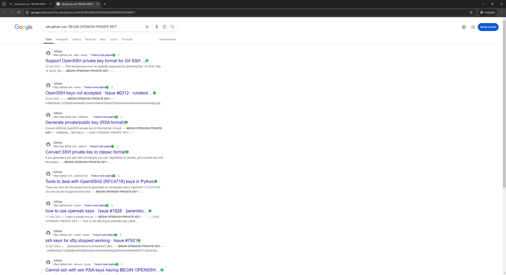
## Shodan
### country:FR "Apache"

####  **¿Qué significa esta búsqueda?**

Cuando realizamos esta búsqueda en Shodan con los términos **"country:FR Apache"**, estamos solicitando al motor de búsqueda que muestre todos los dispositivos conectados a Internet que cumplan con los siguientes criterios:
- **country:FR:** Esta parte de la consulta indica que deseas que Shodan se enfoque en dispositivos ubicados en Francia (FR es el código de país para Francia).
- **Apache:** Este término hace referencia al servidor web Apache, uno de los servidores web más populares y utilizados en el mundo.
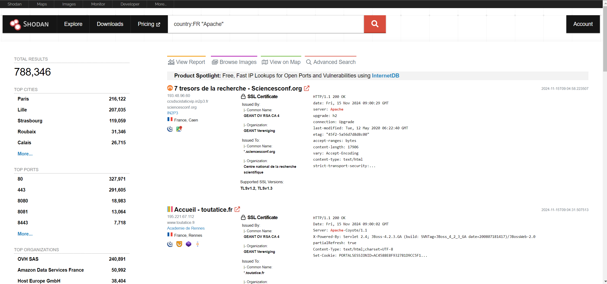
- La pantalla principal de búsqueda nos muestra **788,34** dispositivos/servicios en línea que coinciden con nuestra búsqueda
- Ya que en la búsqueda hemos puesto "Country:FR" únicamente nos muestra resultados de Francia pero obtenemos una clasificación por ciudades de donde hay mayor cantidad de dispositivos que coinciden con nuestra búsqueda.
	- Las ciudades donde se encontraron mas resultados son:
		- París, Lille, Estrasburgo, etc.
	- Puertos más encontrados:
		- 80, 443, 8080, 8081, 8443
#### Ampliación de información
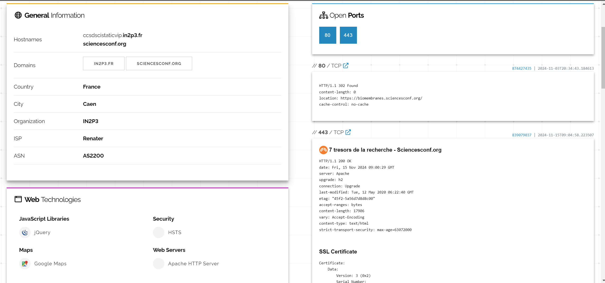
>
>IP encontrada: [**193.48.96.60**](https://www.shodan.io/host/193.48.96.60)
>Ubicación: **5 Quai François Mitterrand**
>ISP: **Renater** *Red nacional de telecomunicaciones para la tecnología, la educación y la investigación de Francia*
>Puertos abiertos: 80/TCP, 443/TCP
- Puerto 80
	- Tiene habilitado HSTS (HTTP Strict Transport Security), lo cual asegura que el navegador solo se comunique con el servidor mediante HTTPS
- Puerto 443 
	- Posee certificado SSL
		- Version 3 estándar X.509
		- Número de serie **23:78:66:bb:00:5b:2a:47:f9:3b:47:f7:39:6b:0a:a0**
	- Algoritmo de firma
		- El certificado usa **sha384WithRSAEncryption** para su firma, un algoritmo que asegura la integridad y autenticidad del certificado.
	- **Emisor (Issuer)**:
		- GEANT Vereniging en los países bajos
	- Validez 
		-  **Fecha de inicio**: 15 de octubre de 2024
		- **Fecha de expiración**: 15 de octubre de 2025.
	- Sujeto 
		- Este certificado está asignado al **Centre national de la recherche scientifique** en Francia.
		- Se emitió específicamente para el dominio **.sciencesconf.org**
	- Clave Pública
		-  **Algoritmo**: **RSA**, con una clave de **2048 bits**.
	- Extensiones X.509v3
		- **Authority Key Identifier** y **Subject Key Identifier**: Permiten rastrear la cadena de certificación, identificando tanto la clave del emisor como la clave específica del certificado.
		-  **Key Usage**: Indica que el certificado permite **firma digital** y **cifrado de claves**.
	- Subject Alternative Name (SAN):
		- Define dominios adicionales para los que el certificado es válido: ***.sciencesconf.org** y **sciencesconf.org.**
- Tecnologías implementadas
	- Javascript
		- jQuery
	- Maps
		- Google Maps
	- Security
		- HSTS
	- WebServer
		- Apache HTTP 

### port: 22 Anonymous access granted
#### ¿Qué significa esta búsqueda?

Cuando realizamos una búsqueda en Shodan con la consulta "port:22 Anonymous access granted", estamos buscando específicamente servidores en Internet que estén escuchando en el **puerto 22** y que además permitan el **acceso anónimo**.

- **Puerto 22:** Este es el puerto estándar para el protocolo SSH (Secure Shell), que se utiliza para la conexión remota segura a sistemas.
- **Anonymous access granted:** Esto indica que el servidor SSH permite a cualquier usuario conectarse sin necesidad de una cuenta o contraseña. En otras palabras, el **acceso es completamente abierto.**
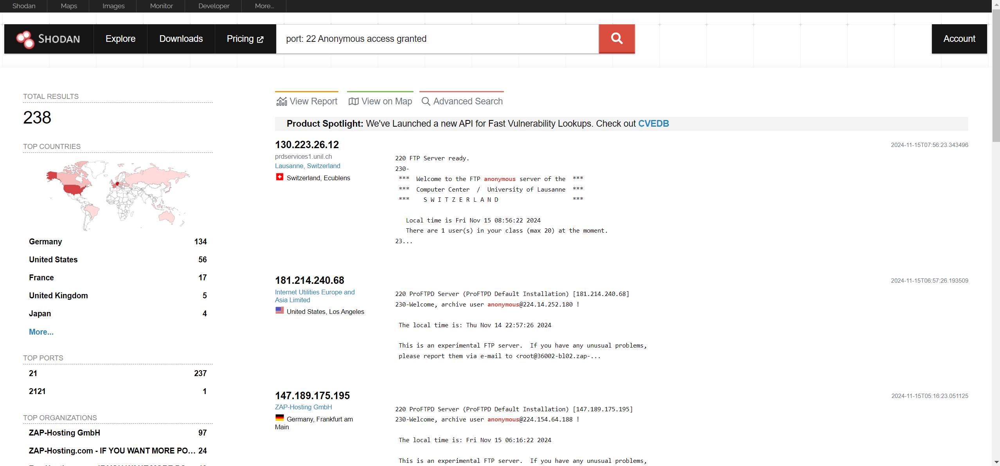
La pantalla principal de búsqueda nos muestra **238** servicios en todo el mundo que coinciden con nuestra búsqueda
- Las ciudades donde se encontraron mas resultados son:
	- Alemania, Estados Unidos, Francia, Reino Unido, Japón
#### Ampliación de información
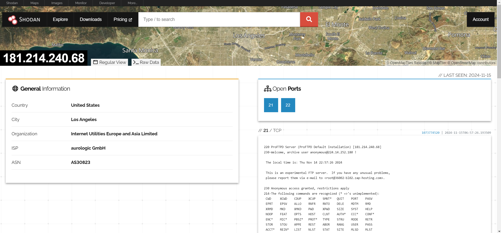
>IP encontrada: [**181.214.240.68**](https://www.shodan.io/host/181.214.240.68)
>Ubicación: Los Ángeles, Estados Unidos. 
>ISP: **[aurologic GmbH](https://www.shodan.io/search?query=isp%3A%22aurologic+GmbH%22)**
>Puertos abiertos: 21,22
### port: 80 country:US has_vuln:true
#### ¿Qué significa esta búsqueda?
- port:80
	- Busca dispositivos que tienen el puerto **80** abierto. Este es el puerto predeterminado para el protocolo HTTP, utilizado por servidores web para transmitir contenido sin cifrar.
- country:US
	- Restringe los resultados a dispositivos ubicados en los Estados Unidos (US).
- has_vuln:true
	- Filtra para mostrar únicamente dispositivos que tienen vulnerabilidades conocidas asociadas. Esto significa que Shodan ha identificado que el servicio o dispositivo reportado tiene una o más vulnerabilidades basadas en datos de CVE (Common Vulnerabilities and Exposures).
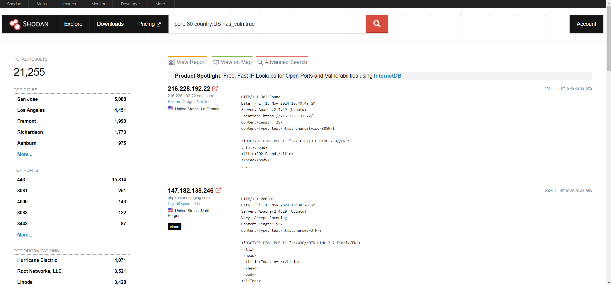
- La pantalla principal de búsqueda nos muestra **21,255** dispositivos en Estados Unidos que tienen el puerto 80 abierto y vulnerabilidades conocidas.
- Ya que en la búsqueda hemos puesto "Country:US" únicamente nos muestra resultados de Estados Unidos pero obtenemos una clasificación por ciudades de donde hay mayor cantidad de dispositivos que coinciden con nuestra búsqueda.
	- Las ciudades donde se encontraron mas resultados son:
		- San José 5,088 dispositivos
		- Los Angeles: 4,451 dispositivos
		- Fremont: 1,990 dispositivos
		- Richardson: 1,773 dispositivos
		- Ashburn: 975 dispositivos
	- Aunque la búsqueda es para el puerto 80, Shodan muestra otros puertos abiertos en estos dispositivos:
		- 443 (Puerto HTTPS): 15,814 dispositivos
		- 8081, 4000, 8083, 8443, etc.
#### Ampliación de información 

>IP encontrada: [147.182.138.246](https://www.shodan.io/host/147.182.138.246)
>Ubicación: North Bergen, Estados Unidos.
>ISP: [DigitalOcean, LLC](https://www.shodan.io/search?query=isp%3A%22DigitalOcean%2C+LLC%22)
>Puertos abiertos: 80, 443, 2222
- Puerto 80
	- Posee más de 68 vulnerabilidades
		- Estas son vulnerabilidades recientes (2022-2024) que afectan comúnmente servidores y servicios web, y que suelen permitir desde escalación de privilegios hasta denegación de servicio o ejecución remota de código.
	 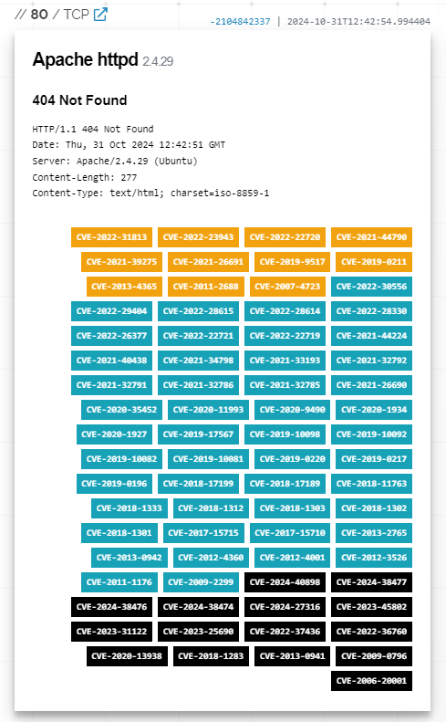
- Estas son algunas de las más recientes con una breve explicación.
	- **CVE-2024-40898** (2024):
		- Vulnerabilidad de **Apache** que permite a atacantes ejecutar código arbitrario debido a una deserialización insegura. Esto significa que un atacante puede inyectar código malicioso que el servidor interpreta y ejecuta.
	- **CVE-2023-25690** (2023):
		-  Problema en el manejo de las solicitudes HTTP de Apache, lo cual podría permitir a un atacante causar una denegación de servicio (DoS) o explotar datos sensibles al forzar comportamientos inusuales en el servidor.
	- **CVE-2022-31813** (2022):
		- Una vulnerabilidad de omisión de autenticación que permite que un atacante eluda ciertos controles de seguridad en Apache HTTP Server, lo que puede permitir acceso no autorizado a recursos restringidos.
	- Hay más que las anteriormente explicadas, pero las explicadas son de las más recientes, aún así las más antiguas siguen siendo relevantes ya que no han sido actualizadas
- Puerto 443
	- También posee las mismas vulnerabilidades
	 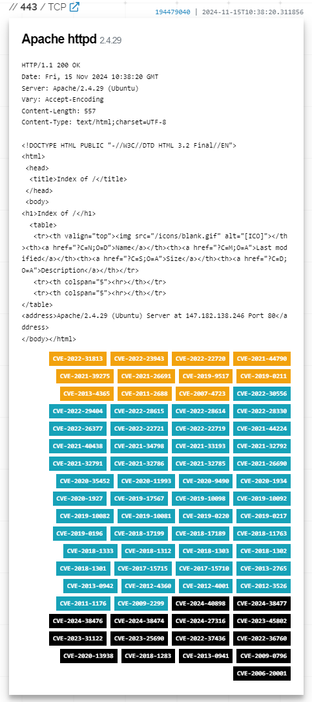
- A continuación explicaré algunas más centrándome en lo que se permite a través de la vulnerabilidad
	- **Ejecución Remota de Código (RCE)**
		- **CVE-2022-22720**: Permite la ejecución de código remoto en Apache HTTP Server debido a una validación incorrecta de entrada en ciertas configuraciones.
		- **CVE-2009-2299**: Desbordamiento de búfer en Apache que permite la ejecución remota de código en ciertas configuraciones.
	- **Denegación de Servicio (DoS)**
		- **CVE-2019-9517**: Permite a un atacante lanzar un ataque DoS a través de la manipulación de solicitudes HTTP/2 en Apache.
		- **CVE-2020-1934**: DoS en Apache debido a un problema en la gestión de las solicitudes proxy.
	- **Escalación de Privilegios**
		- **CVE-2019-0211**: Escalación de privilegios en Apache que permite a un usuario local ejecutar código con permisos de root.
		- **CVE-2022-30556**: Permite a un atacante obtener privilegios adicionales en un entorno Apache debido a una mala configuración de permisos.
	- **Exposición de Información Sensible**
		- **CVE-2021-32792**: Exposición de información en Apache debido a configuraciones incorrectas.
		- **CVE-2020-11993**: Permite a un atacante obtener información confidencial en Apache por problemas en el manejo de ciertas configuraciones.
	- Estas son solo algunas de tantas que hay pero me han parecido las más interesantes a resaltar.
## Reflexión ética
  
Herramientas como Google Hacking y Shodan han revolucionado la ciberseguridad al facilitar la identificación de vulnerabilidades en sistemas. Sin embargo, su uso en sistemas no autorizados plantea riesgos significativos, tanto legales como éticos, que deben ser abordados con seriedad.

Google Hacking utiliza operadores de búsqueda avanzados para encontrar información sensible expuesta accidentalmente en Internet, como configuraciones inseguras o datos privados. Shodan, por su parte, es un motor de búsqueda especializado en dispositivos conectados, desde cámaras de seguridad hasta servidores. Aunque útiles para fortalecer la seguridad, estas herramientas pueden causar daños si se emplean sin autorización, exponiendo datos críticos y generando nuevas vulnerabilidades.

El uso no autorizado de estas herramientas es ilegal en la mayoría de los países. Acceder a sistemas sin permiso es un delito que puede acarrear sanciones económicas, prisión y daño reputacional. Incluso si no hay intención maliciosa, estas acciones pueden ser percibidas como hostiles, poniendo en riesgo a las organizaciones afectadas y comprometiendo su privacidad y operaciones.

En este escenario, el hacker ético tiene una responsabilidad clave: actuar dentro de los límites legales y éticos. La esencia de su labor radica en obtener autorización explícita antes de evaluar un sistema. Operar sin permiso no solo contradice los valores fundamentales de la profesión, sino que también daña la confianza pública en los profesionales de ciberseguridad.

Además, el hacker ético debe adherirse a protocolos de divulgación responsable, informando vulnerabilidades de manera confidencial y constructiva. Este enfoque no solo protege a las organizaciones, sino que también refuerza la percepción del hacking ético como una práctica orientada a la protección y mejora de la seguridad.

En conclusión, herramientas como Google Hacking y Shodan deben usarse con profesionalismo y permiso explícito. Solo respetando las leyes y principios éticos es posible fortalecer la ciberseguridad y consolidar la confianza en quienes trabajan para proteger sistemas y datos.