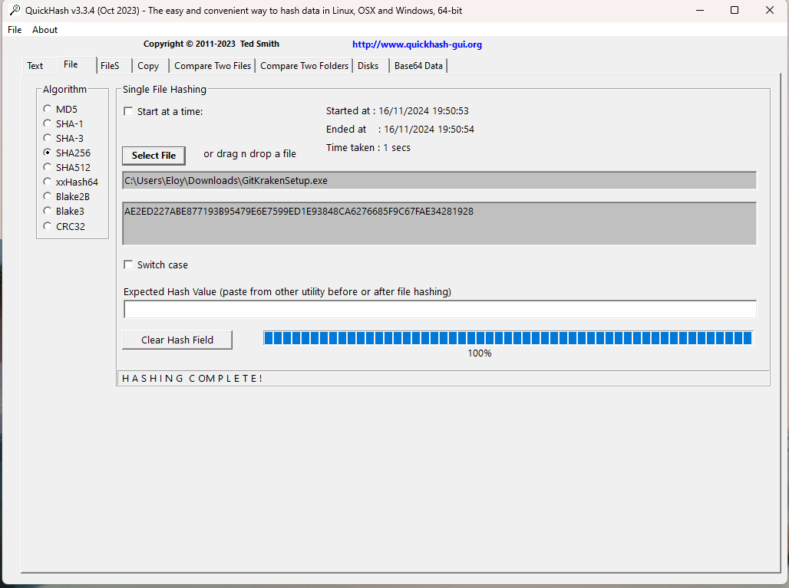
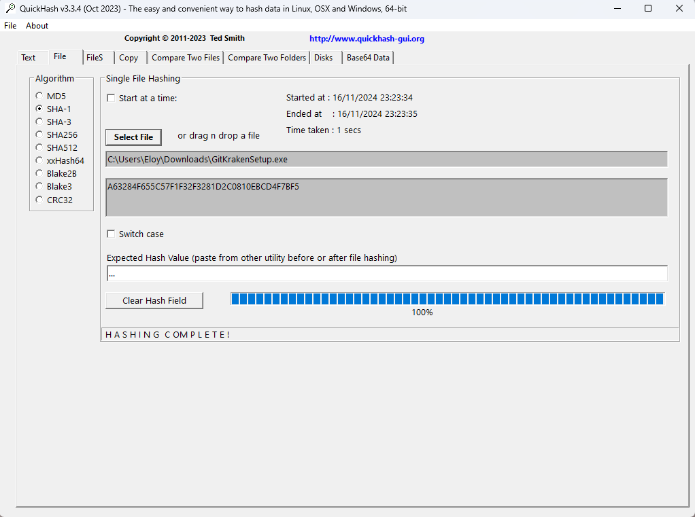

# Verificación de la integridad de archivos mediante funciones hash
## Objetivo
El objetivo de esta tarea es que los estudiantes comprendan el uso de las funciones
hash para garantizar la integridad de los archivos, tanto en sistemas Windows como
Linux. Aprenderán a generar y verificar huellas digitales utilizando distintas
herramientas y algoritmos de hash, reforzando el concepto de seguridad e integridad
en los sistemas.
## 1. Practica en Windows
### Enunciado
Utilizando la herramienta [CertUtil](https://learn.microsoft.com/es-es/windows-server/administration/windows-commands/certutil) en Windows, calcula el hash de un archivo
que tengas disponible en tu ordenador (puede ser un archivo de texto
pequeño o cualquier archivo que elijas).
#### Resultados Powershell MD5

Hash obtenido con el comando 
```
Get-FileHash -Algorithm MD5 .\odoo_18.0.latest.exe

Hash: 8217CC3F2FB082766039DF0E967078F0
```
#### Resultados Powershell SHA256

Hash obtenido con el comando: 
```
Get-FileHash -Algorithm SHA256 .\odoo_18.0.latest.exe

Hash: 4F5312A71C83372A271D5BCE3090901EBF93DAE8326777929BC4DE7603A226CB
```

### Herramienta QuickHash GUI
#### ¿Qué es QuickHash GUI?
[**QuickHash GUI**](https://www.quickhash-gui.org/) es una aplicación de software multiplataforma que permite realizar cálculos de valores hash de manera rápida y sencilla a través de una interfaz gráfica de usuario.
#### Resultado obtenido MD5 QuickHash

En esta aplicación al tener interfaz grafica no se ha realizado ningún comando y he utilizado MD5, claramente con otro .exe en este caso el de GitKraken
```
Hash Obtenido:
8544C8D3138C38945A8CF039F79C5B1F
```
#### Resultado obtenido SHA256 QuickHash

```
Hash Obtenido:
AE2ED227ABE877193B95479E6E7599ED1E93848CA6276685F9C67FAE34281928
```
#### Resultado obtenido SHA-1 QuickHash

```
Hash Obtenido:
A63284F655C57F1F32F3281D2C0810EBCD4F7BF5
```

### ¿Fáciles de usar? 
Realmente cualquiera de las dos es bastante fácil de usar, en powershell para alguien totalmente novato creo que le costará más (tampoco creo que se ponga a comprobar el hash de una aplicación), pero realmente cualquier usuario podría comprobar el hash de cualquier aplicación a través de powershell ya que es una sintaxis muy sencilla, lo único que cambia es que debes poner la ruta del archivo o situarte en el directorio correcto en cambio **QuickHash** es únicamente seleccionar el algoritmo que quieres y buscar el archivo a través de la interfaz grafica lo que hace que sea más cómodo y sencillo.
### Ventaja de tener interfaz gráfica
Claramente al tener una interfaz grafica hace que sea mucho mas cómodo pero yo personalmente no me instalaría nada para una cosa que ya puede hacer tu ordenador.

## Práctica en Linux
### Enunciado 
Utilizando una máquina virtual con Linux o una distribución en modo live,
calcula el hash de un archivo usando los siguientes comandos:
- md5sum para generar el hash MD5.
-  sha256sum para generar el hash SHA-256.
-  Copia y pega en el informe los comandos utilizados y los resultados
obtenidos.
#### Resultado obtenido md5sum LICENSE

```
md5sum LICENSE
84dcc94da3adb52b53ae4fa38fe49e5d
```
Esta vez el archivo elegido a sido un .txt 
#### Resultado obtenido sha256sum LICENSE

```
sha256sum LICENSE
589ed823e9a84c56feb95ac58e7cf384626b9cbf4fda2a907bc36e103de1bad2
```
### ¿Cómo podrías utilizar estos comandos para verificar la integridad de un archivo descargado de internet?
Es muy sencillo, por ejemplo [Ubuntu](http://releases.ubuntu.com/) proporciona sus hash para que los compruebes cuando has descargado la iso de instalación, lo mejor sería que descargases el .txt de su pagina web donde indica el hash y el tipo de algoritmo, igualmente con este sencillo script lo podrías comprobar sin necesidad de descargar el archivo:
```
if [ "$(sha256sum "Archivo descargado" | awk '{print $1}')" = "HASH_ESPERADO" ]; then echo "Son iguales"; else echo "No son iguales"; fi
```
- "Archivo descargado"= ruta de la ISO descargada 
- "HASH_ ESPERADO"= El hash que obtienes en la pagina web

Podemos comprobar que nos muestra por salida que los hash son iguales.

## Comparación de Algoritmos
### ¿Por que los algoritmos **MD5** y **SHA-1** ya no son recomendados para las aplicaciones críticas?
Los algoritmos MD5 y SHA-1 ya no se consideran seguros para aplicaciones críticas debido a **vulnerabilidades criptográficas** que permiten realizar ataques como la **colisión** y la **preimagen**. Estos ataques comprometen la integridad de los datos al generar el mismo hash para dos entradas diferentes o encontrar una entrada que coincida con un hash específico.
- **Colisión**: Es la posibilidad de encontrar dos entradas diferentes que produzcan el mismo hash. Esto permite que un atacante cree un documento malicioso con el mismo hash que un documento legítimo.
- **Preimagen**: Aunque más difícil, consiste en encontrar una entrada que produzca un hash específico, lo que también debilita la seguridad.
### Situación de riesgo
Supongamos que una entidad emisora de certificados (CA) utiliza SHA-1 para firmar certificados digitales SSL/TLS.
- Un atacante podría crear un certificado malicioso con el mismo hash que un certificado legítimo utilizando un ataque de colisión.
- Esto permitiría al atacante suplantar un servidor legítimo (por ejemplo, un sitio web bancario) y realizar un ataque de **hombre en el medio** (MITM) sin que los navegadores detecten la discrepancia.
- Como resultado, los usuarios podrían ser engañados para ingresar datos sensibles como contraseñas o números de tarjetas de crédito en el sitio malicioso.
### Ejemplo real
En 2017, un grupo de investigadores de Google y el CWI de Ámsterdam realizó el ataque [**SHAttered**](https://protegermipc.net/2017/02/28/shattered-attack-sha-1/), demostrando una colisión práctica en SHA-1 al generar dos PDF diferentes con el mismo hash SHA-1. Este experimento subrayó que las colisiones son posibles en tiempo razonable, marcando el fin de la confianza en SHA-1.

### Situaciones en las que podría ser aceptable utilizar MD5 en lugar de algoritmos más seguros como SHA-256 o SHA-512
- En sistemas heredados que usan MD5 y no son prácticos de modernizar a corto plazo, puede ser aceptable seguir utilizándolo como una solución temporal mientras se desarrolla una estrategia de migración.
- En aplicaciones no criticas como he mencionado anteriormente una ISO de Ubuntu 
- Puede ser útil en aplicaciones internas no expuestas al público, como bases de datos o sistemas de cacheo, donde se utiliza para identificar rápidamente duplicados o validar consistencia.
## Importancia de las funciones hash en la seguridad informática
Las funciones hash son elementos cruciales en la seguridad informática. Permiten convertir datos en valores únicos de longitud fija, cuya protección se logra a través del almacenamiento de contraseñas en forma de hash, lo que dificulta su robo. Asimismo, garantiza la integridad de la información, ya que cualquier modificación realizada en los datos resulta en un hash diferente. Las funciones hash también son utilizadas para las firmas digitales y los certificados que garantizan que un archivo o mensaje fue creado por su remitente; además, es lo que permite detectar cualquier modificación en el texto firmado, también para los sistemas hash o proof of work. En general, las funciones hash son esenciales para la protección de la información, y la confianza en los sistemas digitales.